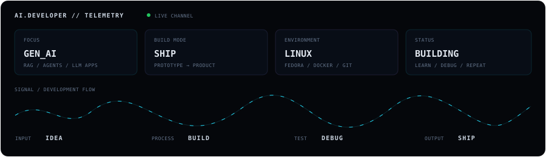
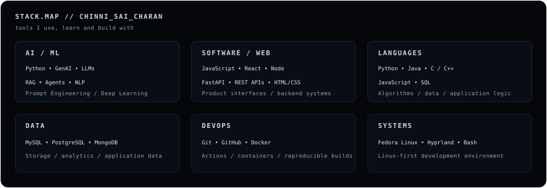
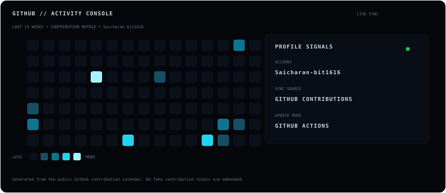

<p align="center">
  
</p>

<p align="center">
  
</p>

## About the Builder

I’m **Chinni Sai Charan**, an AI & Data Science student who likes turning ideas into working software. My interests sit at the intersection of **Generative AI, machine learning, full-stack development, developer tooling, cloud technologies, and Linux systems**.

I learn best by building: taking an idea, breaking it into systems, shipping a prototype, debugging what breaks, and then making the result genuinely useful.

<p align="center">
  
</p>

## Current Build Queue

### AI Review Intelligence
An AI-focused project exploring how machine learning and NLP can identify suspicious, low-quality, or manipulated product reviews and ratings.

### F1 Racing Telemetry Dashboard
A data-driven racing dashboard concept for visualizing telemetry, performance signals, and race analytics in an interactive interface.

### AI Developer Tools
Exploring AI-powered tools that can automate repetitive development workflows, reason over project information, and improve developer productivity.

## Technical Stack

<p align="center">
  
</p>

## How I Build

| Principle | What it means |
| --- | --- |
| **Learn by building** | Projects are my laboratory. |
| **AI + engineering** | Models are useful when they become reliable products. |
| **Keep it practical** | Prefer simple systems that solve a real problem. |
| **Automate the boring parts** | Use tools, containers, workflows and agents wherever they add value. |
| **Ship, then improve** | A working first version beats a perfect idea that never leaves the notebook. |

## AI / Generative AI

```text
IDEA → DATA → MODEL / LLM → RAG / TOOLS → AGENT → PRODUCT
```

I’m particularly interested in **LLM applications, RAG, AI agents, prompt engineering, NLP, deep learning, and the engineering required to turn intelligent models into usable applications**.

## GitHub Activity

<p align="center">
  
</p>

## Credentials & Learning

- Claude Certified Architect
- Google AI Essentials
- GitHub Foundations
- IBM SkillsBuild
- HubSpot Digital Marketing
- Oracle learning / certifications
- NPTEL learning
- Springboard learning

> Certificate dates, credential IDs and links are intentionally omitted until verified.

## Connect

<p align="center">
  <a href="https://github.com/Saicharan-bit1616"></a>
  <a href="https://www.linkedin.com/in/chinni-sai-charan/"></a>
  <a href="https://YOUR-PORTFOLIO.example"></a>
</p>

<p align="center">
  
</p>

<p align="center">
  <sub>CHINNI SAI CHARAN // AI • SOFTWARE • SYSTEMS</sub>
</p>
